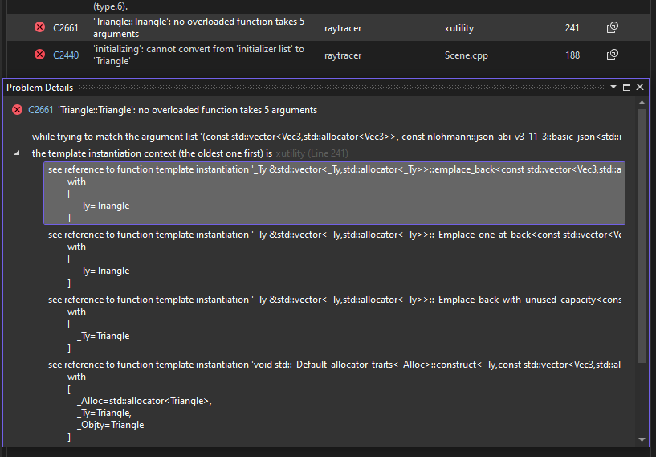

+++
title = "Visual Studio Tricks I Wish I Knew From the Start"
date = "2024-08-24"
draft = false
categories = ["C++", "Visual Studio"]

+++

# Debugging Perfect Forwarders in Visual Studio IDE

Visual Studio tends to give really bad error messages for perfect forwarders. For example, if I give the wrong arguments to std::vector's `emplace_back`, I will get sent to a line in xmemory.h, and not the the line of code I wrote.

Previously, I debugged this by deliberately raising a warning every time I used a perfect forwarder, so I can easily go back and correct the line if needed. But today I learned there's a way of going up the "error hierarchy" by right-clicking on the error -> "Show Problem Details". I can then choose from a list of places that lead to the error, similar to a call stack. My code is typically at the top of this list.

This can be especially useful for large code bases, where it's not feasible to manually search for all the problematic perfect forwarders. I'm actually surprised that such basic functionality of the IDE is not placed in a more obvious place in the UI.

